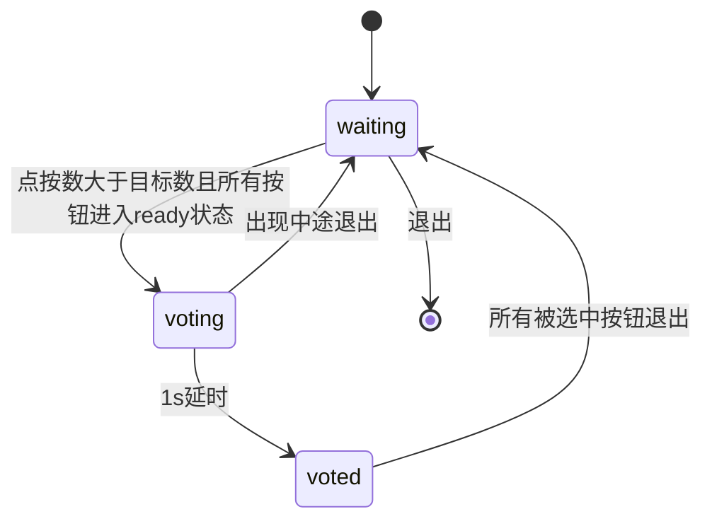
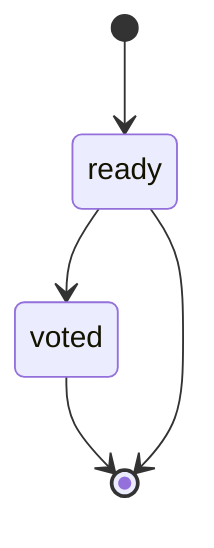

## 自动机

- 全局状态

```mermaid
stateDiagram-v2
  waiting
  voted
  voting
  [*] --> waiting
  waiting --> voting : 点按数大于目标数且所有按钮进入ready状态
  waiting --> [*] : 退出
  voting --> voted : 1s延时
  voting --> waiting : 出现中途退出
  voted --> waiting : 所有被选中按钮退出
```

- 按钮状态

```mermaid
stateDiagram-v2
  [*] --> ready
  ready --> voted
  voted --> [*]
  ready --> [*]
```

